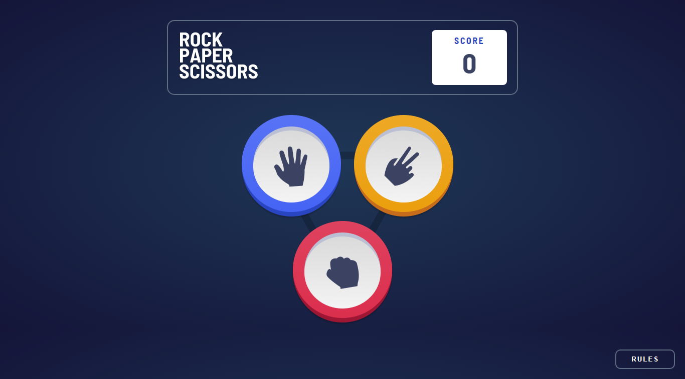
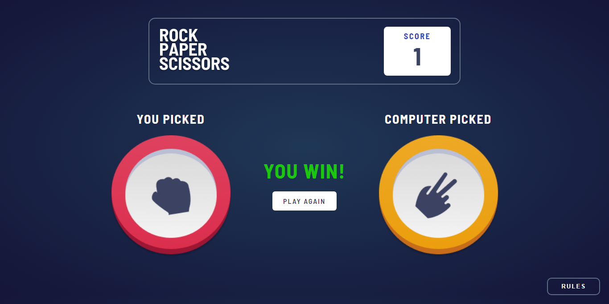
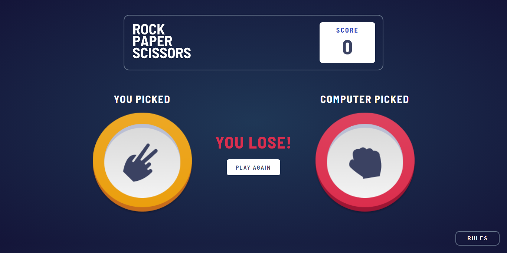
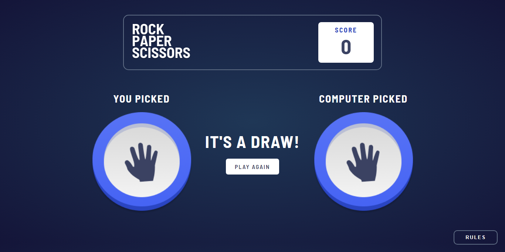
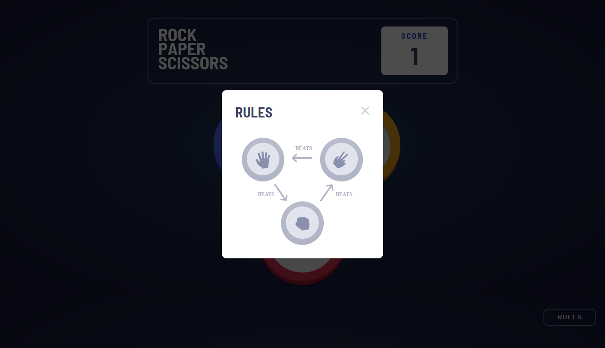

### Links

- Solution URL:
  [https://www.frontendmentor.io/solutions/rock-paper-scissors-game-lp2oRhjXWx]
- Live Site URL: [https://rock-paper-scissors-frontend-mentor-chi.vercel.app/]

### The challenge

Users should be able to:

- View the optimal layout for the game depending on their device's screen size
- Play Rock, Paper, Scissors against the computer

### Screenshot

### Built with

- HTML5
- SASS
- JavaScript

# Frontend Mentor - Rock, Paper, Scissors Game solution

This is a solution to the
[Rock, Paper, Scissors Game challenge on Frontend Mentor](https://www.frontendmentor.io/challenges/rock-paper-scissors-game-pTgwgvgH).
